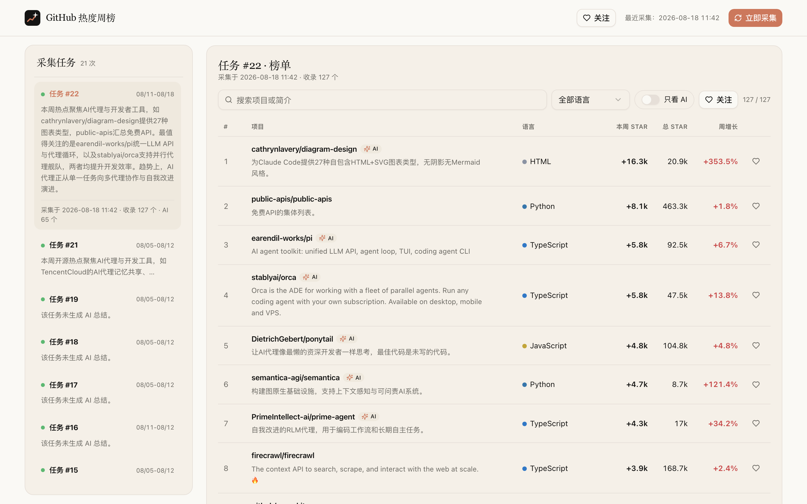
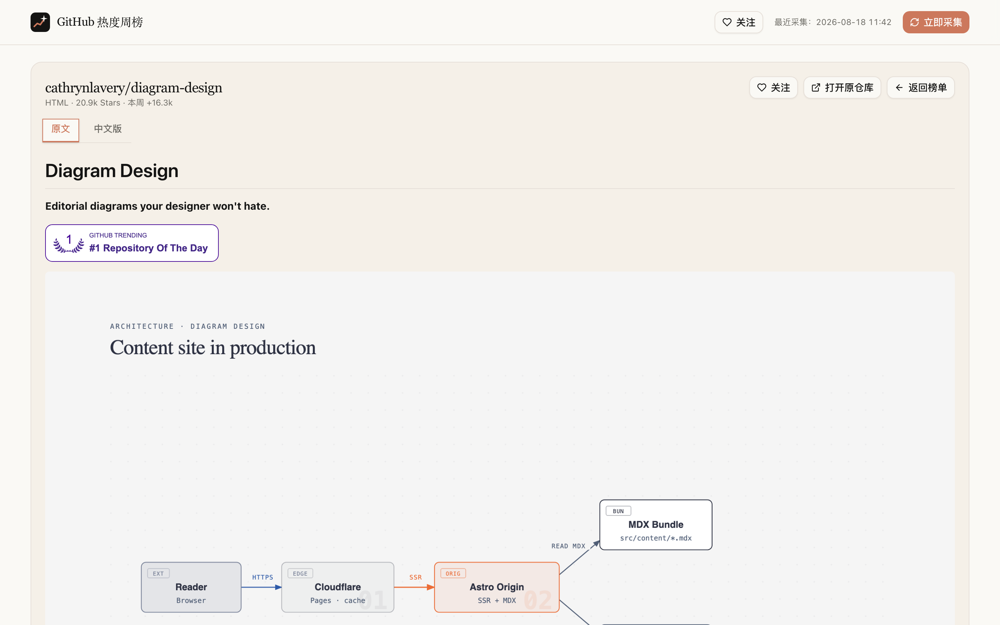

# github-hot

[](https://github.com/faukwaa/github-hot/actions/workflows/collect.yml)

调研 GitHub 最近一周 Star 增长最快的开源项目（全部收录，AI 项目自动标注）。

工具每天抓取 GitHub Trending 的 weekly 页面（全部语言 + Python、TypeScript、JavaScript、Go、Rust、C++、Jupyter Notebook），解析每个仓库的“本周新增 Star”，并用关键词与 topics 给 AI 项目打标（不默认过滤）。可选通过 GitHub Search API 补充一周内新创建的高 Star AI 仓库，并把结果存入 SQLite，输出 CLI 榜单或 Web 仪表盘。

**每次拉取都是一个任务**：采集完成后登记为一条任务记录，配置 AI Key 后，AI 会给该次拉取写一段任务总结，并为每个仓库生成一句中文简介（存入库中，CLI 与 Web 都会展示）。

## 界面预览



仓库详情页支持 README 原文 / AI 中文版双语切换：



## 快速开始

项目只依赖 Python 3.9+ 标准库，无需安装第三方包：

```bash
python3 -m github_hot collect
python3 -m github_hot report
python3 -m github_hot serve
```

不带子命令时先采集再输出榜单：

```bash
python3 -m github_hot
```

打开 http://127.0.0.1:8787 查看极简 Web 仪表盘；页面包含采集任务列表（含 AI 任务总结）与完整榜单（每行带 AI 一句话简介），可用搜索框和“只看 AI”开关筛选。

Web 页面为独立路由：列表页 `/`，仓库详情页 `/repo/owner/name`（可直接访问或分享，支持浏览器前进/后退）。

## 前端构建（可选）

Web 仪表盘前端基于 React + Tailwind + shadcn/ui，源码在 `frontend/`。仓库已包含构建产物，直接 `serve` 即可；修改前端后需要重新构建：

```bash
cd frontend
npm install
npm run build
```

构建产物输出到 `frontend/dist/`，`python3 -m github_hot serve` 会自动托管；未构建时回退到内置精简版页面。开发时可 `npm run dev`（默认代理到 127.0.0.1:8799 的 API）。

## 自动采集（GitHub Actions）

仓库内置每日自动采集：北京时间每天 09:30 由 Actions 在 `data` 分支上运行 `collect` 并提交最新数据库，无需本地开机。

- 手动触发：仓库 Actions → Auto Collect → Run workflow
- 云端 AI 总结需在仓库 Settings → Secrets and variables → Actions 添加 `DEEPSEEK_API_KEY`（可选）
- 同步云端最新数据到本地：`git fetch origin && git checkout origin/data -- data/github_hot.db`

## 通过 AI 调用

所有命令都有稳定的人类可读输出与机器可读输出，适合交给 AI 助手（Claude Code、Cursor、任意 Agent）代为执行与解读。

### 给 AI 的提示词（可直接复制）

```text
你可以使用 github-hot-cli 管理并分析 GitHub 热度周榜（项目位于 ~/code/AI/github-hot）。
可用命令：
- github-hot-cli collect [--no-ai] [--languages a,b] [--since daily|weekly|monthly]
  [--ai-only] [--with-search] [--api-top N]  采集一次数据，每次采集登记为一个任务
- github-hot-cli report [--limit N] [--ai-only] [--json]  输出榜单；--json 时返回
  {"report": {items, meta}, "tasks": [...]}，tasks 含每次采集的 AI 总结
- github-hot-cli tasks [--delete ID]  查看/删除任务历史
- github-hot-cli serve [--port 8787]  启动 Web 仪表盘
数据字段：items[].full_name / stars / weekly_stars / weekly_growth(%) /
language / is_ai / ai_summary(中文一句话简介)；tasks[].summary(该次采集的中文总结)。
常用做法：先 collect，再 report --json 解析结果回答我的问题。
```

### 机器可读输出

`--json` 返回单一 JSON 对象，适合 AI 直接解析：

```bash
github-hot-cli report --json --limit 10        # 榜单 + 任务历史（含 AI 总结）
github-hot-cli report --json --ai-only         # 只看 AI 项目
```

返回结构：

```json
{
  "report": {
    "items": [
      {"full_name": "...", "stars": 20900, "weekly_stars": 16300,
       "weekly_growth": 352.1, "language": "HTML", "is_ai": true,
       "ai_summary": "中文一句话简介", "url": "https://github.com/..."}
    ],
    "meta": {"collected_at": "...", "repo_count": 127, "ai_count": 65}
  },
  "tasks": [
    {"id": 23, "collected_at": "...", "repo_count": 127, "summary": "该次采集的 AI 中文总结"}
  ]
}
```

要点：采集进度与人类提示走 stderr，stdout 只有纯 JSON，管道安全；`--no-ai` 可在未配置 AI Key 时正常采集。

### 作为 Claude Code / Agent 技能

把上面的提示词保存为项目内 `SKILL.md`（或放入 `.claude/skills/`），Agent 即可自主完成“采集 → 解析 → 回答”闭环，例如：

- “帮我看看本周涨星最快的 3 个项目是什么，分别干什么的”
- “只看 AI 项目，按增长率排序”
- “把最新一次采集的总结发我”

## 交互式终端工具

在项目目录直接运行交互式菜单，可以在终端里完成采集、看榜单、查看任务历史、启停 Web 仪表盘：

```bash
./github-hot
```

也可以写成模块形式：

```bash
python3 -m github_hot ui
```

菜单选项：

```text
1. 采集数据（每次拉取登记为任务，自动生成 AI 总结）
2. 查看全部榜单
3. 查看 AI 榜单
4. 查看采集任务历史
5. 启动 Web 仪表盘
6. 停止 Web 仪表盘
0. 退出
```

想装成全局命令也可以：

```bash
uv pip install -e .
github-hot
```

## 命令说明

```bash
# 采集数据（可指定语言、标注过滤与搜索补充）
python3 -m github_hot collect \
  --languages python,typescript,go \
  --with-search \
  --limit 50

# 只输出榜单
python3 -m github_hot report --limit 20 --json

# 只保留 AI 项目
python3 -m github_hot collect --ai-only
python3 -m github_hot report --ai-only

# 查看采集任务历史（含每次拉取的 AI 总结）
python3 -m github_hot tasks

# 跳过 AI 总结（不配置 AI Key 时自动跳过）
python3 -m github_hot collect --no-ai

# 启动 Web 仪表盘
python3 -m github_hot serve --port 8787
```

常用参数：

- `--db`：SQLite 数据库路径，默认 `data/github_hot.db`
- `--since`：`daily` / `weekly` / `monthly`，默认 `weekly`
- `--languages`：逗号分隔的 Trending 语言页，留空使用默认列表
- `--ai-only`：只保留标注为 AI 的项目，默认全部收录并标注
- `--with-search`：用 GitHub Search API 补充一周内新建的 AI 仓库
- `--api-top N`：用 REST API 补全前 N 个仓库的 topics、创建时间等元数据
- `--no-ai`：跳过 AI 任务总结与仓库一句话简介
- `--json`：榜单输出 JSON，便于后续分析

## 配置 AI 总结（可选）

设置任一个 AI Key 后，采集会自动生成任务总结与仓库一句话简介（OpenAI 兼容接口）：

```bash
# DeepSeek（推荐，配置后自动使用 deepseek-chat 与 DeepSeek 端点）
export DEEPSEEK_API_KEY=sk-xxx

# 或任意 OpenAI 兼容服务
# export AI_API_KEY=sk-xxx
# export AI_BASE_URL=https://your-provider/v1   # 可选
# export AI_MODEL=your-model                      # 可选
```

不配置 AI Key 时采集照常进行，任务会登记但跳过 AI 总结。

也可以把 Key 写入项目根目录的 `.env` 文件（自动加载，配置一次永久生效，优先级低于环境变量）：

```bash
# .env
DEEPSEEK_API_KEY=sk-xxx
# GITHUB_TOKEN=ghp_xxx
```

## 配置 GITHUB_TOKEN

GitHub API 未认证时搜索接口限 10 次/分钟。建议设置 token 提高配额并获得更完整元数据：

```bash
export GITHUB_TOKEN=ghp_xxx
```

设置后采集会默认用 REST API 补全前 30 个仓库的元数据。

## 数据与实现

- 主数据源：GitHub Trending 页面（非官方接口，页面结构变化时解析器可能需要更新）
- 补充数据源：GitHub Search API 的 `topic:* created:>=7天前` 查询
- AI 判断：仓库名、简介中的关键词（llm、gpt、rag、agent、pytorch、大模型等）或 topics 命中，命中结果作为标注展示，不默认过滤
- 采集任务：每次拉取在 `tasks` 表登记一条记录，AI 总结失败不阻断采集，任务标记为失败并保留错误信息
- 存储：SQLite 以 `full_name` 为主键保存最新一次采集快照，重复采集会覆盖同一仓库的数据
- 服务：标准库 `http.server`，无外部依赖；仪表盘为极简单页 HTML + 原生 JS，遵循 DESIGN.md 设计语言

## 项目结构

```text
github_hot/
  config.py     配置与常量
  models.py     数据模型
  fetch.py      HTTP 抓取与重试
  trending.py   GitHub Trending 页面解析
  filters.py    AI 项目关键词过滤
  ai.py         AI 任务总结与仓库一句话简介（OpenAI 兼容）
  store.py      SQLite 存储（repos + tasks）
  pipeline.py   采集流水线（每次拉取登记任务）
  report.py     榜单计算
  cli.py        命令行入口（collect/report/serve/ui/tasks）
  tui.py        交互式终端菜单
  server.py     本地 Web 服务
  dashboard.py  仪表盘页面
github-hot      可直接执行的交互式终端入口
frontend/       React + Tailwind + shadcn/ui 前端（构建产物 dist/ 由 serve 托管）
pyproject.toml  打包与全局命令配置
tests/          单元测试
```

## 测试

```bash
python3 -m unittest discover -s tests -v
```
